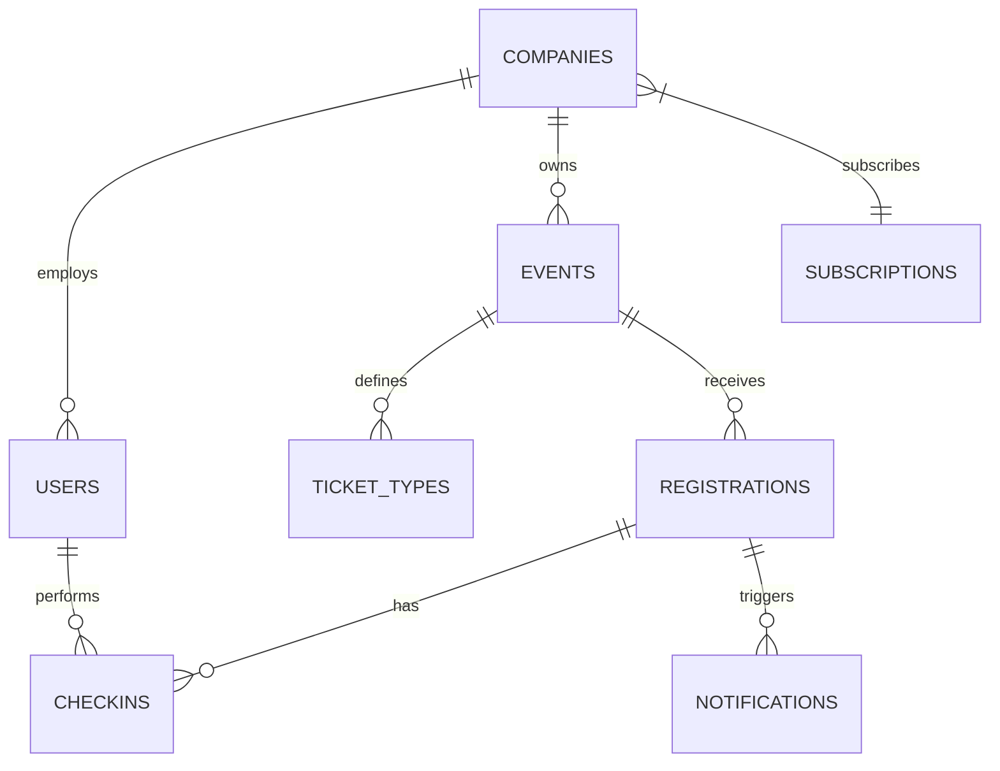

# EventPass - Smart Event Management & QR Check-in Platform
## AI Execution & Project Specification Document (Laravel 13 + Filament v5 Monolith)

> **Instructions for AI Coding Assistants:**  
> This file contains the complete requirements, architecture, data models, and system specifications for **EventPass**.  
> All feature additions, schema modifications, or logic changes MUST strictly align with this document.

---

## 1. Executive Summary & Core Requirements

**EventPass** is a multi-tenant SaaS platform built with **Laravel 13** and **Filament v5**, designed to streamline event creation, ticket generation with unique signed QR codes, public attendee registration, staff check-in scanning, and analytics reporting.

### Core Stack
- **Language:** PHP 8.4
- **Framework:** Laravel 13 (Latest)
- **Admin & Dashboard:** Filament v5 (Latest)
- **Frontend / Scanner:** Livewire v5 & TailwindCSS tickets and QR Code verification.

### Key Capabilities
- Multi-tenant company workspaces with isolated data (Filament Tenancy).
- Public event registration pages with custom dynamic form fields (Blade / Livewire).
- Automated ticket generation (Unique Ticket ID, QR Code, PDF download/email).
- Mobile-optimized entrance check-in system with camera QR scanning, validation, and real-time audio/visual status feedback.
- Automated email workflow (Confirmation + PDF ticket, pre-event reminders, post-event survey).
- Waiting list system with automated slot notification.
- Event feedback & rating system.
- Comprehensive Filament analytics & reporting (attendee stats, check-in rates, data export).
- SaaS Subscription & Plan management (Free, Business, Enterprise).

---

## 2. Technology Stack & Infrastructure Specifications

### Core Framework & Dashboard
- **Backend & Framework:** PHP 8.3+ / Laravel 12 (Latest)
- **Admin Dashboard & Workspace:** Filament v3 (Latest) - for Super Admin Panel & Company Multi-Tenant Workspace
- **Public & Scanner Pages:** Laravel Livewire v3 / Blade + Alpine.js + TailwindCSS
- **Database:** PostgreSQL or MySQL
- **Caching & Queue:** Redis / Laravel Queues (for async email sending & PDF generation)
- **PDF & QR Packages:** `barryvdh/laravel-dompdf`, `simplesoftwareio/simple-qrcode`
- **Permissions:** `spatie/laravel-permission`
- **Containerization:** Docker & Docker Compose setup

---

## 3. Core System Roles & Permissions

| Role | Scope | Description & Key Privileges |
| :--- | :--- | :--- |
| **Super Admin** | Platform Level | Global system owner. Filament Admin Panel (`/admin`). Manages companies, subscriptions, plans, system settings, global analytics, and activity logs. |
| **Company Admin** | Company Workspace | Owner/Manager of a specific company. Filament Company Tenant Panel (`/app`). Creates events, customizes tickets, manages team staff, views/exports reports. |
| **Event Staff** | Event Level | Entrance check-in operator. Accesses mobile-optimized Livewire check-in camera scanner view. Scans QR codes, verifies tickets, approves/rejects entry. |
| **Attendee** | Public / End User | Public Blade/Livewire views (`/events/{slug}`). Registers for events, receives digital ticket & QR code, downloads PDF, receives email updates, submits feedback. |

---

## 4. Feature Modules & Workflow Requirements

### Module 1: Multi-Tenant Company Workspace (Filament Tenancy)
- Company Profile: Name, Logo, Description, Contact details, Branding settings (primary color, logo).
- Team Management: Invite staff, assign roles (`Company Admin`, `Event Staff`), revoke access using Spatie Permissions & Filament Tenancy.

### Module 2: Event Management (Filament Resource)
- Fields: `title`, `description`, `cover_image`, `location`, `google_maps_url`, `start_date`, `end_date`, `registration_start_date`, `registration_end_date`, `max_capacity`, `event_type`, `status`.
- Event Status Flow: `Draft` $\rightarrow$ `Published` $\rightarrow$ `Closed` $\rightarrow$ `Finished`.

### Module 3: Dynamic Public Registration System (Livewire Component)
- Unique public route: `/events/{event-slug}`.
- Shows event details, schedule, location map link, available ticket types.
- Dynamic custom registration fields configurable by company (Full Name, Email, Phone, Company, Job Title, National ID, custom text/select questions).

### Module 4: Ticket Generation & Verification Engine
- Auto-generates unique Ticket ID format: `EVT-{YYYY}-{6-DIGIT-INCREMENTAL-ID}` (e.g., `EVT-2026-000001`).
- Generates secure QR Code containing signed ticket hash / token.
- Generates downloadable PDF ticket containing Event details, Attendee info, QR Code, branding.

### Module 5: QR Code Check-in System (Livewire Mobile Camera Scanner)
- Real-time HTML5/JS QR scanner integration with Livewire backend.
- Verification Logic:
  1. Does ticket exist?
  2. Is it for the correct event?
  3. Is registration status `approved`?
  4. Has it already been used (`checked_in_at` non-null)?
- Immediate Visual Feedback:
  - **SUCCESS (ACCESS GRANTED):** Green notification, attendee name, ticket category, check-in timestamp.
  - **FAILURE (ACCESS DENIED):** Red notification with reason (e.g. `Ticket Already Used`, `Invalid Event`, `Cancelled`).

### Module 6: Attendance & Waiting List Management
- Real-time Filament Widgets & Tables: Total Registrations, Checked In, Pending, Attendance Rate (%).
- Attendee table with search, filter by ticket type/status, CSV/Excel export (Filament Actions).
- Waiting List: Auto-engages when `max_capacity` is reached. Automatically notifies top of waiting list if a registration is cancelled.

### Module 7: Email Notification System (Queued Mailables)
- Registration Confirmation: Sends ticket summary + attached PDF ticket + embedded QR code.
- Reminder Email: Triggered 24h before `start_date`.
- Post-Event Feedback Email: Triggered after `end_date` with survey link (rating + comment).

### Module 8: Custom Ticket Styling & Categories
- Custom ticket categories (VIP, Regular, Speaker, Organizer, Sponsor) with specific capacity, pricing (if applicable), and badge design.
- Ticket template customization: Upload company logo, secondary colors, custom terms/footer text.

### Module 9: Analytics & Reporting (Filament Widgets)
- Registration trajectory chart (Filament Chart Widget).
- Attendance breakdown (Checked in vs No-show).
- CSV / Excel / PDF export capabilities for company admins.

### Module 10: SaaS Subscriptions & System Admin
- Plans:
  - **Free:** Max 3 Events, 100 Attendees/Event, Basic Features.
  - **Business:** Unlimited Events, 5,000 Attendees/Event, Analytics, Ticket Customization.
  - **Enterprise:** Unlimited Events/Attendees, White Labeling, Priority Support.

---

## 5. Database Schema & Architecture

### 1. `companies`
| Column | Type | Constraints | Description |
| :--- | :--- | :--- | :--- |
| `id` | `bigint` | Primary Key | Auto increment / UUID |
| `name` | `string` | Not Null | Company legal name |
| `logo` | `string` | Nullable | Image path / URL |
| `branding` | `json` | Nullable | Color codes, background, footer settings |
| `subscription_id` | `bigint` | Nullable, Foreign Key | Refers to active subscription plan |
| `created_at` | `timestamp` | System | Creation date |
| `updated_at` | `timestamp` | System | Modification date |

### 2. `users`
| Column | Type | Constraints | Description |
| :--- | :--- | :--- | :--- |
| `id` | `bigint` | Primary Key | Auto increment / UUID |
| `company_id` | `bigint` | Nullable, Foreign Key | Company workspace scope |
| `name` | `string` | Not Null | User full name |
| `email` | `string` | Unique, Not Null | Auth email |
| `password` | `string` | Not Null | Hashed password |
| `role` | `enum` | SuperAdmin, CompanyAdmin, EventStaff | User system role |
| `created_at` | `timestamp` | System | Creation date |
| `updated_at` | `timestamp` | System | Modification date |

### 3. `events`
| Column | Type | Constraints | Description |
| :--- | :--- | :--- | :--- |
| `id` | `bigint` | Primary Key | Auto increment / UUID |
| `company_id` | `bigint` | Foreign Key | Owner company |
| `title` | `string` | Not Null | Event title |
| `slug` | `string` | Unique, Not Null | URL slug |
| `description` | `text` | Nullable | Detailed event info |
| `location` | `string` | Not Null | Venue / Address |
| `google_maps_url`| `string` | Nullable | Location link |
| `cover_image` | `string` | Nullable | Image URL |
| `start_date` | `dateTime` | Not Null | Event start time |
| `end_date` | `dateTime` | Not Null | Event end time |
| `registration_start_date` | `dateTime` | Nullable | Registration open time |
| `registration_end_date` | `dateTime` | Nullable | Registration close time |
| `capacity` | `integer` | Default 0 | Max allowed attendees |
| `status` | `enum` | Draft, Published, Closed, Finished | Current event state |
| `created_at` | `timestamp` | System | Creation date |
| `updated_at` | `timestamp` | System | Modification date |

### 4. `ticket_types`
| Column | Type | Constraints | Description |
| :--- | :--- | :--- | :--- |
| `id` | `bigint` | Primary Key | Auto increment |
| `event_id` | `bigint` | Foreign Key | Parent event |
| `name` | `string` | Not Null | e.g. VIP, Regular, Speaker |
| `capacity` | `integer` | Not Null | Ticket type limit |
| `price` | `decimal` | Default 0.00 | Ticket price |
| `created_at` | `timestamp` | System | Creation date |
| `updated_at` | `timestamp` | System | Modification date |

### 5. `registrations`
| Column | Type | Constraints | Description |
| :--- | :--- | :--- | :--- |
| `id` | `bigint` | Primary Key | Auto increment / UUID |
| `event_id` | `bigint` | Foreign Key | Event registered for |
| `ticket_type_id` | `bigint` | Nullable, Foreign Key | Selected category |
| `name` | `string` | Not Null | Attendee full name |
| `email` | `string` | Not Null | Attendee email |
| `phone` | `string` | Nullable | Phone number |
| `custom_fields_data` | `json` | Nullable | Form responses |
| `ticket_code` | `string` | Unique, Not Null | Format: `EVT-2026-XXXXXX` |
| `qr_code` | `string` | Unique, Not Null | Signed payload / token |
| `status` | `enum` | Pending, Approved, Waitlisted, Cancelled | Registration status |
| `checked_in_at` | `timestamp` | Nullable | Null if not checked in |
| `created_at` | `timestamp` | System | Registration date |
| `updated_at` | `timestamp` | System | Modification date |

### 6. `checkins`
| Column | Type | Constraints | Description |
| :--- | :--- | :--- | :--- |
| `id` | `bigint` | Primary Key | Auto increment |
| `registration_id`| `bigint` | Foreign Key | Checked-in registration |
| `staff_id` | `bigint` | Foreign Key | User who performed scan |
| `checkin_time` | `timestamp` | Not Null | Exact timestamp |
| `device` | `string` | Nullable | Device user agent / browser |
| `status` | `enum` | Granted, Denied | Scan result |
| `created_at` | `timestamp` | System | Log creation |

### 7. `notifications`
| Column | Type | Constraints | Description |
| :--- | :--- | :--- | :--- |
| `id` | `bigint` | Primary Key | Auto increment |
| `user_id` | `bigint` | Nullable, Foreign Key | Recipient user/attendee |
| `type` | `string` | Not Null | `confirmation`, `reminder`, `feedback` |
| `status` | `enum` | Pending, Sent, Failed | Email queue status |
| `sent_at` | `timestamp` | Nullable | Dispatch time |
| `created_at` | `timestamp` | System | Creation date |

---

## 6. Security & Operational Requirements

1. **Authentication & Authorization:** Filament Auth, Spatie Roles & Permissions, Multi-tenant scope.
2. **Multi-Tenancy Isolation:** Filament Tenancy scoping resources by `company_id`.
3. **QR Code Security:** QR payload contains signed payload / HMAC hash to prevent ticket tampering.
4. **Rate Limiting:** Protect public registration and scan endpoints against abuse.
5. **Audit Logging:** System logs for critical administrative actions and staff check-ins.
